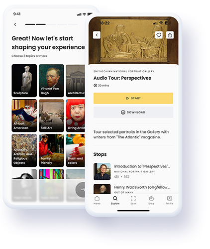

# COMM4190 Spring 2025 - Research Project

## From Static Plaques to Smart Tracks: How AI Audio Guides Are Personalizing the Museum Visit

### Overview

My paper discusses the Smithsonian American Art Museum's partnership with Smartify's LLM-based personalized AI audio guide to co-create tours. Using a 2024 conference transcript with museum executives, along with KANO-model research on interactive exhibits, and telemetry analytics on visitor flow, the piece has a straightforward query: what changes, if anything, when metal wall labels turn into AI audio tracks? Initial data from the guide's first 90 days feature on 35000 unique users, a 42% tour-completion rate, and—arguably most important—who the users were: a demographic flip to roughly 70% of visitors under 40, with 34% Gen Z, and a quarter of those reporting return visits. Theory from the field of communication helps delineate the data: positive expectancy violations (especially casual asides, or artist cameos) engage attention, while speedy tap-through provenance cards complete uncertainty-reduction processes. It's worth noting that minimally more than 90 seconds of clip duration, on the other hand, produces information fatigue. The main finding is simply that AI narration can enhance engagement and extend reach, but only if pacing, transparency, and tone controls allow the "wow factor," created by audio narration, to avoid simply becoming digital noise.

### Sections

[Research Paper](/researchpaper.ipynb)

[Bibliography](/bibliography.ipynb)

[Images](/images)

